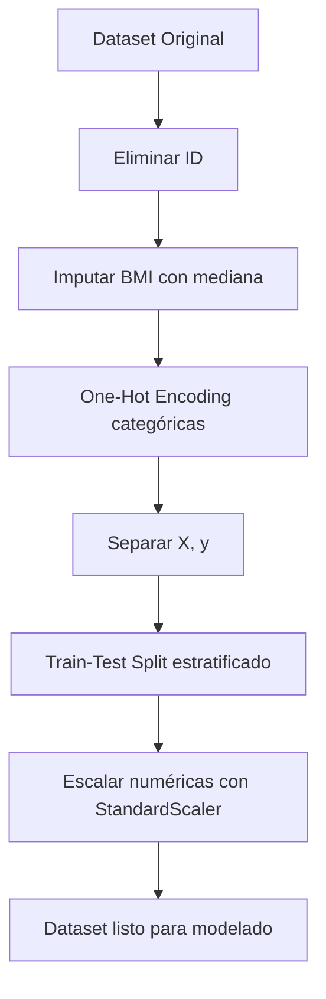

# Documentación de Preprocesamiento de Datos
## Stroke Prediction Dataset

---

## 1. Visión General del Dataset

| Característica | Valor |
|----------------|-------|
| Registros | 5,110 |
| Variables | 12 (11 predictoras + 1 objetivo) |
| Variable objetivo | `stroke` (0 = No ACV, 1 = ACV) |
| Fuente | Kaggle - Stroke Prediction Dataset |

---

## 2. Análisis de Variables

### 2.1 Variables Numéricas
| Variable | Descripción | Tipo | Rango Típico |
|----------|-------------|------|--------------|
| `id` | Identificador único | int | - |
| `age` | Edad del paciente | float | 0-82 |
| `avg_glucose_level` | Nivel promedio de glucosa | float | 55-270 |
| `bmi` | Índice de masa corporal | float | 10-100 |

### 2.2 Variables Categóricas
| Variable | Descripción | Valores Posibles |
|----------|-------------|------------------|
| `gender` | Género | Male, Female, Other |
| `hypertension` | Hipertensión | 0 (No), 1 (Sí) |
| `heart_disease` | Enfermedad cardíaca | 0 (No), 1 (Sí) |
| `ever_married` | Estado civil | Yes, No |
| `work_type` | Tipo de trabajo | Private, Self-employed, Govt_job, children, Never_worked |
| `Residence_type` | Tipo de residencia | Urban, Rural |
| `smoking_status` | Estado de fumador | formerly smoked, never smoked, smokes, Unknown |

---

## 3. Limpieza de Datos

### 3.1 Eliminación de Columna ID
**Qué se hizo:** Se eliminó la columna `id` del dataset.

**Por qué:** El identificador único no aporta información predictiva. Mantenerlo puede:
- Introducir ruido en el modelo
- Causar overfitting al memorizar IDs específicos
- Aumentar innecesariamente la dimensionalidad

```python
df = df.drop('id', axis=1)
```

---

### 3.2 Tratamiento de Valores Faltantes (BMI)

**Hallazgo:** La variable `bmi` contiene valores faltantes (aproximadamente 200 registros con "N/A" como string o NaN).

**Qué se hizo:** Imputación con la **mediana** del dataset.

**Por qué se eligió la mediana en lugar de la media:**

| Criterio | Media | Mediana |
|----------|-------|---------|
| Sensibilidad a outliers | Alta | Baja |
| Distribución de BMI | Sesgada a la derecha | - |
| Representatividad | Puede ser inflada por valores extremos | Valor central real |

El BMI típicamente tiene una distribución con sesgo positivo (más personas con valores altos extremos), por lo que la mediana es más robusta.

```python
# Convertir 'N/A' a NaN
df['bmi'] = df['bmi'].replace('N/A', np.nan).astype(float)
# Imputar con mediana
df['bmi'] = df['bmi'].fillna(df['bmi'].median())
```

---

### 3.3 Tratamiento de Valores Categóricos Especiales

**Hallazgo:** `smoking_status` contiene el valor "Unknown" (aproximadamente 30% de los datos).

**Decisión:** Mantener "Unknown" como categoría separada.

**Justificación:**
1. Eliminar estos registros reduciría significativamente el dataset
2. "Unknown" puede representar un patrón real (pacientes que no reportan)
3. El modelo puede aprender si "Unknown" tiene correlación con el outcome

---

## 4. Codificación de Variables Categóricas

### 4.1 One-Hot Encoding

**Qué se hizo:** Se aplicó One-Hot Encoding a las variables categóricas nominales.

**Variables codificadas:**
- `gender` → `gender_Male`, `gender_Female`, `gender_Other`
- `ever_married` → `ever_married_Yes`, `ever_married_No`
- `work_type` → 5 columnas binarias
- `Residence_type` → `Residence_type_Urban`, `Residence_type_Rural`
- `smoking_status` → 4 columnas binarias

**Por qué One-Hot Encoding:**

| Alternativa | Problema |
|-------------|----------|
| Label Encoding | Introduce orden artificial (ej: Male=0, Female=1 implica Female > Male) |
| Ordinal Encoding | Solo para variables con orden natural |
| One-Hot | Representa correctamente variables nominales sin orden |

```python
df_encoded = pd.get_dummies(df, columns=['gender', 'ever_married', 'work_type', 
                                          'Residence_type', 'smoking_status'], 
                            drop_first=True)
```

> **Nota:** Se usa `drop_first=True` para evitar multicolinealidad perfecta (trampa de la variable dummy).

---

## 5. Escalado de Variables Numéricas

### 5.1 Estandarización (StandardScaler)

**Qué se hizo:** Se aplicó estandarización (Z-score) a las variables numéricas.

**Variables escaladas:** `age`, `avg_glucose_level`, `bmi`

**Fórmula aplicada:**
$$z = \frac{x - \mu}{\sigma}$$

Donde:
- $x$ = valor original
- $\mu$ = media de la variable
- $\sigma$ = desviación estándar

**Por qué es crítico el escalado:**

| Modelo | Sin Escalado | Con Escalado |
|--------|--------------|--------------|
| **KNN** | Variables con rangos grandes dominan la distancia euclidiana | Todas las variables contribuyen equitativamente |
| **Perceptrón** | Convergencia lenta o no convergencia | Convergencia más rápida |
| **MLP** | Gradientes desbalanceados, activaciones saturadas | Entrenamiento estable |

**Ejemplo del problema sin escalado (KNN):**
- `age` tiene rango [0-82]
- `avg_glucose_level` tiene rango [55-270]

La distancia euclidiana estaría dominada por glucose porque tiene mayor rango numérico, ignorando la importancia de la edad.

```python
from sklearn.preprocessing import StandardScaler

scaler = StandardScaler()
numerical_cols = ['age', 'avg_glucose_level', 'bmi']
df_encoded[numerical_cols] = scaler.fit_transform(df_encoded[numerical_cols])
```

> **Importante:** El escalador se ajusta (`fit`) solo con datos de entrenamiento y se aplica (`transform`) tanto a train como test para evitar data leakage.

---

## 6. Tratamiento del Desbalance de Clases

### 6.1 Análisis del Desbalance

**Hallazgo:** El dataset está altamente desbalanceado.

| Clase | Cantidad | Porcentaje |
|-------|----------|------------|
| stroke = 0 | ~4,861 | ~95% |
| stroke = 1 | ~249 | ~5% |

**Impacto del desbalance:**
- Un modelo que prediga siempre "0" tendría ~95% de accuracy
- El modelo puede ignorar la clase minoritaria (stroke=1)
- Métricas como accuracy son engañosas

### 6.2 Estrategias Consideradas

| Técnica | Descripción | Aplicación |
|---------|-------------|------------|
| **SMOTE** | Genera ejemplos sintéticos de la clase minoritaria | Opcional |
| **Class weights** | Penaliza más los errores en la clase minoritaria | Recomendado |
| **Undersampling** | Reduce ejemplos de la clase mayoritaria | Pérdida de información |

**Decisión:** Usar `class_weight='balanced'` en los modelos que lo soporten y monitorear **Recall de la clase 1** como métrica principal.

```python
# Ejemplo con Perceptrón
from sklearn.linear_model import Perceptron
model = Perceptron(class_weight='balanced')
```

---

## 7. Partición de Datos

### 7.1 Train-Test Split

**Configuración:**
- **Proporción:** 80% entrenamiento, 20% prueba
- **Estratificación:** Sí (mantiene proporción de clases)
- **Random state:** 42 (reproducibilidad)

```python
from sklearn.model_selection import train_test_split

X_train, X_test, y_train, y_test = train_test_split(
    X, y, 
    test_size=0.2, 
    random_state=42, 
    stratify=y  # Mantiene proporción de clases
)
```

**Por qué estratificar:** Con solo ~5% de casos positivos, una partición aleatoria simple podría generar un test set con muy pocos casos de stroke, haciendo la evaluación poco confiable.

---

## 8. Resumen del Pipeline de Preprocesamiento



---

## 9. Consideraciones Adicionales

### 9.1 ¿Qué pasaría sin estas transformaciones?

| Paso Omitido | Consecuencia |
|--------------|--------------|
| No imputar BMI | Errores de ejecución o pérdida de ~200 registros |
| No codificar categóricas | Los modelos no pueden procesar strings |
| No escalar | KNN inútil, MLP inestable |
| No estratificar | Test set podría no tener casos stroke=1 |

### 9.2 Orden de Operaciones

1. **Primero:** Limpieza general (ID, imputación)
2. **Segundo:** Codificación (antes del split para conocer todas las categorías)
3. **Tercero:** Split train/test
4. **Cuarto:** Escalado (fit en train, transform en ambos)

Este orden evita **data leakage** - el test set no influye en ninguna decisión del preprocesamiento.
